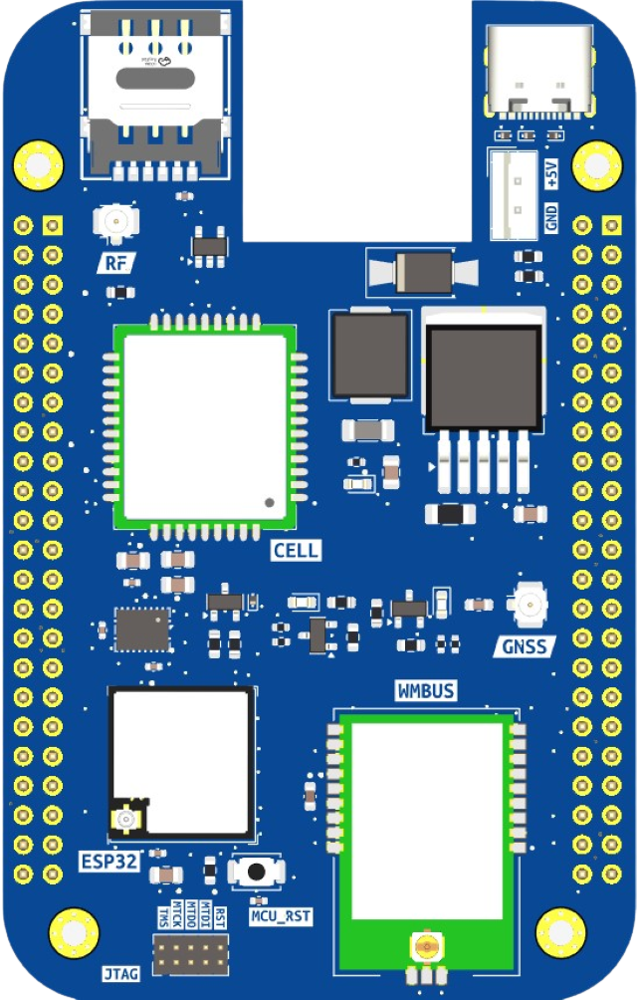

# 🔌 S0 Gateway

S0 is a modular **IoT gateway** built around the **ESP32-C6 (RISC-V)** platform, offering advanced wireless capabilities such as **Wi-Fi 6**, **Bluetooth 5**, and **802.15.4**. It supports multiple connectivity options including **NB-IoT/LTE-M** and optional **Ethernet**, enabling secure and scalable IoT deployments across **smart buildings**, **industrial environments**, and **city infrastructure**.

Optimized for **low-power, battery-powered operation** and modular expansion, S0 integrates **secure communication**, **local storage**, and multiple radio interfaces to serve as a versatile edge gateway in modern **IoT ecosystems**. While it includes support for **Wireless and Wired M-Bus**, its primary focus is on broad **IoT connectivity** and **interoperability**.

  

## 🌟 Features

- ⚙️ **RISC-V Architecture**: Powered by **ESP32-C6** with a RISC-V core for efficiency and flexibility.
- 📡 **Advanced Wireless Connectivity**: Supports **Wi-Fi 6**, **Bluetooth 5**, and **802.15.4** for robust IoT networking.
- 🌐 **Multiple Uplink Options**: Provides **NB-IoT/LTE-M** and optional **Ethernet** for reliable data transmission.
- 🔋 **Battery-Powered Operation**: Optimized for low-power deployments with long-lasting battery support.
- 🔐 **Advanced Security**: Includes **RSA-3072 secure boot**, **AES-128/256-XTS flash encryption**, **digital signature**, **HMAC identity protection**, and **hardware cryptographic accelerators** for performance. Built-in **Trusted Execution Environment (TEE)** ensures secure software separation.
- 🛠️ **Modular Design**: Optional Baseboard adds **Ethernet**, **Wired M-Bus**, and extra power options.
- 💾 **Local Storage**: Optional **microSD card** slot for logging and offline data buffering.
- 🔗 **Flexible IoT Connectivity**: Integrates with [**Magistrala**](https://github.com/absmach/magistrala) using multiple IoT protocols, including **MQTT**, **CoAP**, **HTTP**, and **WebSockets**.
- 🧩 **Zephyr RTOS Support**: Compatible with **Zephyr** for real-time, reliable IoT applications.
- 🖥️ **WebAssembly Runtime**: Runs lightweight, portable edge logic with **WAMR** (WebAssembly Micro Runtime).
- 🌀 **Propeller Orchestrator Integration**: Works with [**Propeller**](https://github.com/absmach/propeller) for secure, policy-driven orchestration of IoT workloads across the edge-cloud continuum.
- 📈 **Future-Ready for IoT Ecosystems**: Designed for interoperability in **smart buildings**, **industrial IoT**, and **city-scale deployments**.

## 🛠️ How It Works

1. **Connect & Collect**  
   Gather data from IoT sensors and devices via Wireless/Wired M-Bus, Wi-Fi, BLE, or IEEE 802.15.4.

2. **Process at the Edge**  
   Use the **ESP32-C6** for real-time processing or deploy **WebAssembly (Wasm)** modules with **WAMR** for flexible edge logic execution.

3. **Ensure Security**  
   Protect data and code integrity with **secure boot**, **flash encryption**, and **TEE-based isolation**, leveraging ESP32-C6 hardware security features.

4. **Transmit to IoT Platform**  
   Send processed data using **NB-IoT/LTE-M** or optional **Ethernet**, supporting multiple protocols (**MQTT**, **CoAP**, **HTTP**, **WebSockets**) for seamless integration with [**Magistrala**](https://github.com/absmach/magistrala).

5. **Orchestrate & Scale**  
   Integrate with the [**Propeller Orchestrator**](https://github.com/absmach/propeller) for policy-driven deployment and orchestration of workloads across the edge-cloud continuum.

6. **Manage Remotely**  
   Perform **OTA updates**, monitor device health, and manage configurations through connected IoT management tools.

## 📖 Documentation

For setup instructions, pinouts, and integration guides, see the full documentation:  
🔗 [S0 Documentation](https://github.com/absmach/s0-docs)

## 💡 Use Cases

- 🏢 **Smart Buildings**: Connect heat and water meters via Wireless M-Bus for real-time monitoring.
- 🏭 **Industrial IoT**: Collect and transmit sensor data in secure and bandwidth-constrained environments.
- 🌍 **Smart Cities**: Enable large-scale metering infrastructure with NB-IoT and LoRa connectivity.
- 🔐 **Secure Data Acquisition**: Ensure encrypted communication from edge devices to the cloud.

## 🔧 Hardware Highlights

- **Core Board**:
  - MCU: **ESP32-C6** (RISC-V architecture)
  - Connectivity: **Wi-Fi 6**, **Bluetooth 5**, **IEEE 802.15.4**, **Wireless M-Bus (RC-S2LP)**, **NB-IoT/LTE-M + GNSS (SIM7080G)**
  - Security: **Secure Boot**, **Flash Encryption**, **TEE**, Hardware Crypto Accelerators
  - Power: **USB-C**, 7.4 V battery, or Baseboard power supply

- **Baseboard**:
  - Ethernet: **W5500 controller**
  - Wired M-Bus: **TSS721A transceiver**
  - Storage: **microSD card slot**
  - Power: **24 V DC input**, battery charger

## 🤝 Contributing

Contributions are welcome! Please check the [CONTRIBUTING.md](#) for details on how to get started.

## 📜 License

S0 is licensed under the **Apache-2.0 License**. See the [LICENSE](LICENSE) file for more details.
